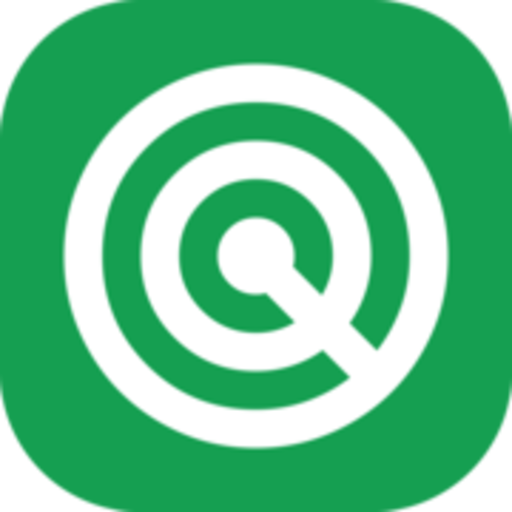
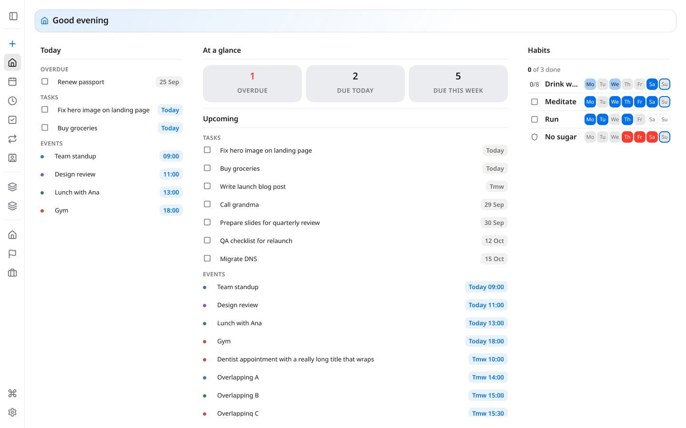
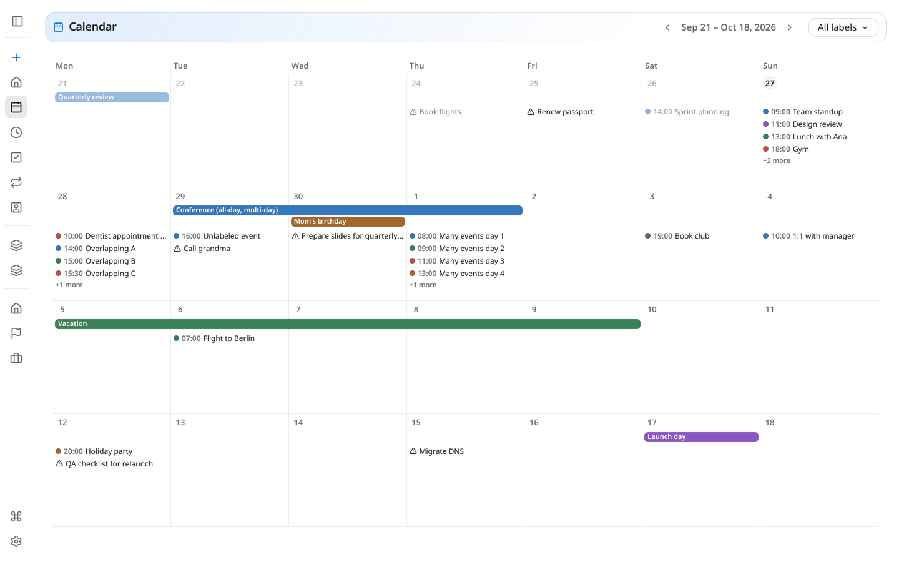
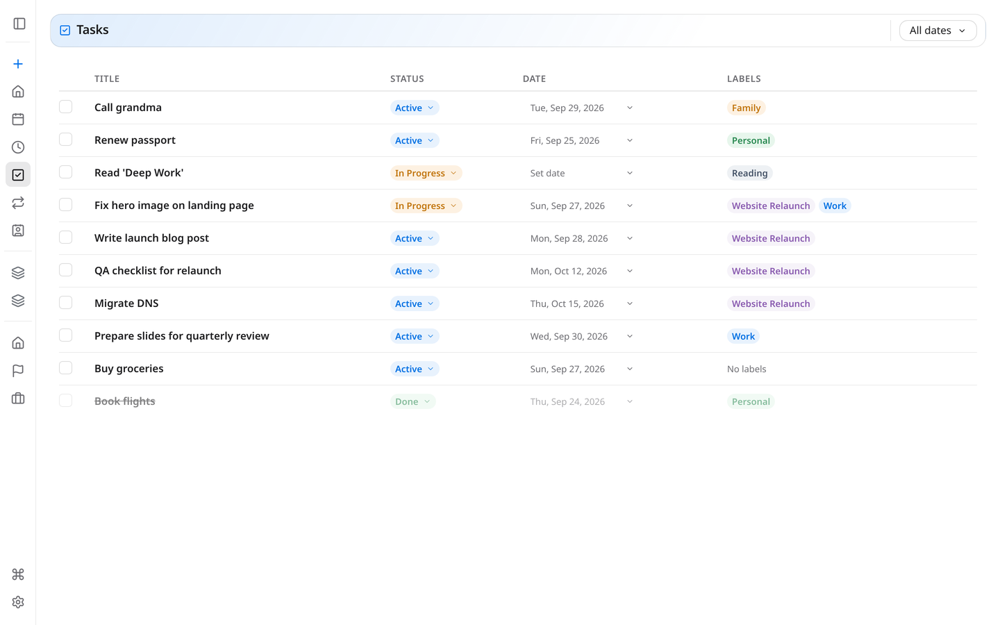
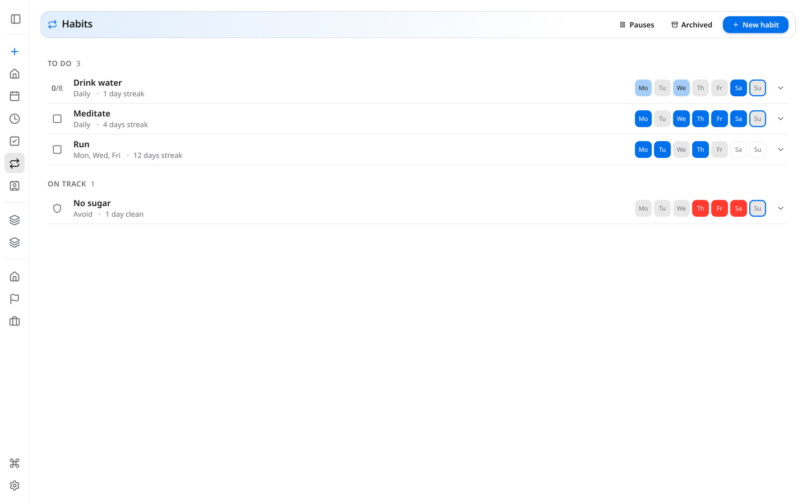

# Curodav

A self-hosted **personal organizer** for one person, which you run on your
own server and open in any browser. It has a home dashboard with widgets, a
calendar, tasks and projects, habit tracking, contacts and notes, all
organized by one shared label system. You can install it on your phone as an
app (a PWA), and it keeps working offline.

No cloud account, no subscription, no telemetry. Your data stays in one file
on a machine you control.

|                                                          |                                                          |
| -------------------------------------------------------- | -------------------------------------------------------- |
|  |    |
|          |        |

**Contents:** [Is this for you?](#is-this-for-you) ·
[Try it in 2 minutes](#try-it-in-2-minutes) ·
[Install it on a server](#install-it-on-a-server) ·
[Before you expose it to a network](#before-you-expose-it-to-a-network) ·
[Phone sync](#phone-sync-what-it-does-and-doesnt-do) ·
[Everyday commands](#everyday-commands) ·
[Documentation](#documentation)

## Is this for you?

A good fit if:

- You want **one private place** for your calendar, to-dos, habits and
  contacts, and you're the only user. There are no shared accounts and no
  team features, by design.
- You're comfortable **running a few commands over SSH** on a Linux box (a
  spare PC, a Raspberry Pi, a small VPS, or a Proxmox VM/LXC) and reading a
  log file when something goes wrong.

Probably not a fit if:

- You need several people to share it, or real-time collaboration.
- You expect your phone's built-in calendar app to be the main way you edit
  things. The app is browser-first. Phone calendar sync exists, but it only
  goes one way (see [Phone sync](#phone-sync-what-it-does-and-doesnt-do)).
- You'd rather not run a server at all. There's no hosted version.

## Try it in 2 minutes

This runs on your own computer, touches nothing outside the project folder,
and gets deleted along with that folder. It's fine for evaluating the app,
**but it isn't meant for real use**: it has no login and uses throwaway
test credentials.

You need [Python 3.12+](https://www.python.org/downloads/) and
[`uv`](https://docs.astral.sh/uv/getting-started/installation/), a Python
package manager that installs everything else for you.

```bash
git clone https://github.com/istorie-petru/curodav.git
cd curodav/webapp
./run.sh
```

Open <http://127.0.0.1:8000> in a browser, and press `Ctrl+C` in the
terminal to stop it. To remove it completely, delete the `curodav` folder.

## Install it on a server

You can install it in two ways. Both run the same app, so pick whichever
matches how you already manage servers.

| | **`curodav-ctl` (systemd)** | **Docker Compose** |
|---|---|---|
| Runs on | Debian 12 (bare metal, VM or LXC) | Any host with Docker |
| Updates | One command, with an automatic rollback if the new version fails its health check | `git pull` + rebuild, no automatic rollback |
| Phone sync over the internet | Automated (`install --dav`, via Cloudflare Tunnel) | Not automated, you set up the proxy yourself |
| Best if | You want the most hands-off, supported path | You already run everything in containers |

### Option A: `curodav-ctl` (recommended)

SSH into a **Debian 12** machine where you have `sudo`, then run:

```bash
git clone https://github.com/istorie-petru/curodav.git /tmp/bootstrap
sudo /tmp/bootstrap/scripts/curodav-ctl install
rm -rf /tmp/bootstrap
```

The installer creates a dedicated system user, installs the app under
`/srv/curodav`, and registers it as a systemd service, so it starts on boot
and restarts itself if it crashes. Along the way it asks two optional
questions (an admin username, and phone sync); pressing Enter to skip both
is fine.

### Option B: Docker Compose

```bash
git clone https://github.com/istorie-petru/curodav.git
cd curodav/deploy/docker
cp .env.example .env
nano .env                    # set RADICALE_PASSWORD and CC_AUTH_SECRET
./create-radicale-user.sh    # one-time
docker compose up -d --build
```

To generate a good value for `CC_AUTH_SECRET`, run `openssl rand -hex 32`.

### Then: create your login

Open `http://<your-server-ip>:8000` (for Docker, use the `APP_PORT` you set).
The first visit shows a one-time **setup page** where you choose a username
and password. After that, the app asks you to log in.

The full guides, covering what each step does, every `curodav-ctl` command,
configuration options and troubleshooting, are on the Wiki:
[Deploying with curodav-ctl](../../wiki/Deploying-with-curodav-ctl) and
[Deploying with Docker](../../wiki/Deploying-with-Docker).

## Before you expose it to a network

The login page keeps strangers out of the app, but **the app doesn't encrypt
traffic itself**. It speaks plain HTTP. Choose one of these:

- **Tailscale (easiest, recommended).** [Tailscale](https://tailscale.com/)
  is a free private network between your own devices. Install it on the
  server and on your phone and laptop, then open the app at the server's
  Tailscale address. Nothing is exposed to the public internet, and you
  don't need a domain or a certificate.
- **A public domain with HTTPS.** You need this only if you want the app or
  phone sync reachable from anywhere without a VPN. `curodav-ctl install
  --dav` sets this up through Cloudflare Tunnel, with no port-forwarding and
  no certificates to renew. It also turns on a firewall that leaves only
  SSH open, so from then on you reach the app at `https://your-domain`
  instead of port 8000.

**Don't** forward port 8000 on your router straight to the internet.

## Phone sync: what it does and doesn't do

You edit your data in the app, either in a browser or in the installed PWA,
which also works offline. To get events, tasks or contacts into your
**phone's own calendar or contacts app**, you create a **Published List** in
Settings. A Published List is a label filter, such as "everything tagged
Work", that turns into a calendar or address-book feed your phone can
subscribe to with [DAVx5](https://www.davx5.com/) on Android or the built-in
account settings on iOS.

- The sync is **one-way**: changes made on the phone don't come back into
  the app.
- It needs **Radicale**, a small CalDAV/CardDAV server. The Docker setup
  includes it. On the `curodav-ctl` path, the installer asks whether to set
  it up, and you can add it later with `sudo curodav-ctl install --dav`. You
  can skip Radicale if you only use the browser.
- A Published List can also be made **public**, which gives it an
  unguessable link that the app serves directly, with no Radicale needed.
  This is handy for sharing a feed with someone else.
- To reach it from outside your home network, see
  [`deploy/README.md`](deploy/README.md). It has the Cloudflare Tunnel setup
  and the exact DAVx5 fields to fill in.

## Everyday commands

For the `curodav-ctl` install:

| I want to… | Run |
|---|---|
| Update to the latest version | `sudo curodav-ctl update` |
| Undo the last update | `sudo curodav-ctl revert` |
| Check that everything is healthy | `curodav-ctl status` |
| See the logs | `sudo journalctl -u curodav -f` |

For Docker: `git pull && docker compose up -d --build` updates it, and
`docker compose logs -f app` shows the logs.

Forgot your password, or something's broken? See
[Maintenance & Troubleshooting](../../wiki/Maintenance-and-Troubleshooting).

## Documentation

The rest of the documentation lives on the **[project Wiki](../../wiki)**,
which is split into two tracks:

- **Running it:** [Getting Started](../../wiki/Getting-Started) ·
  [Deploying with curodav-ctl](../../wiki/Deploying-with-curodav-ctl) ·
  [Deploying with Docker](../../wiki/Deploying-with-Docker) ·
  [Configuration](../../wiki/Configuration) ·
  [Maintenance & Troubleshooting](../../wiki/Maintenance-and-Troubleshooting) ·
  [Flairs](../../wiki/Flairs)
- **Changing the code:** [Architecture](../../wiki/Architecture) (read this
  first) · [Feature Map](../../wiki/Feature-Map) ·
  [Code Style & Structure](../../wiki/Code-Style-and-Structure) ·
  [UI Design Guide](../../wiki/UI-Design-Guide)

Built with Python (FastAPI), server-rendered Jinja templates, vanilla
JavaScript and SQLite. There's no frontend framework and no build step.
Contributions are welcome. Start with [`CONTRIBUTING.md`](CONTRIBUTING.md).
To report a security issue, see [`SECURITY.md`](SECURITY.md).

## Versioning and license

The current version is in [`VERSION`](VERSION), and it matches the latest
`vX.Y.Z` git tag. [`CHANGELOG.md`](CHANGELOG.md) has one entry per release.
Curodav is licensed under **AGPL-3.0** (see [`LICENSE`](LICENSE)).
